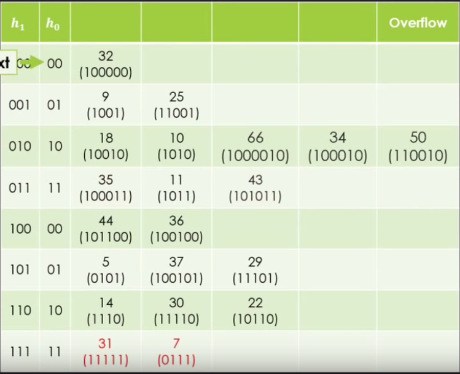
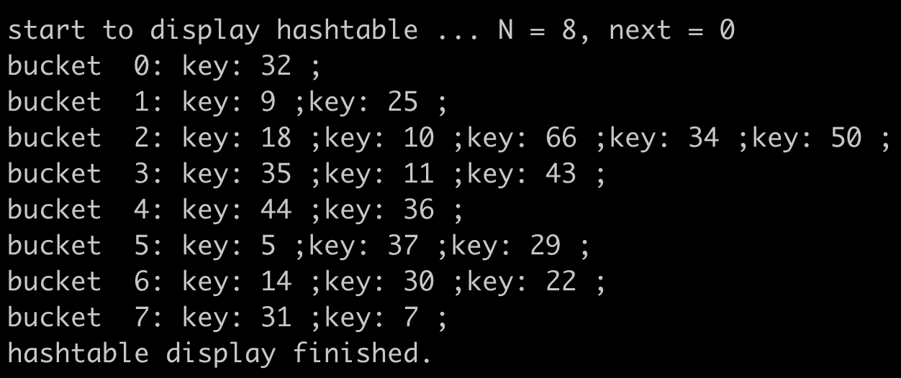
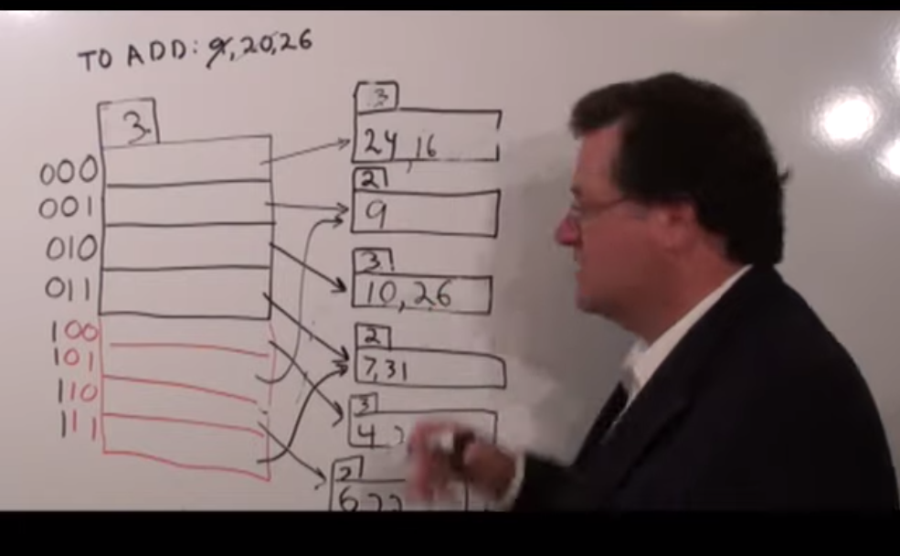
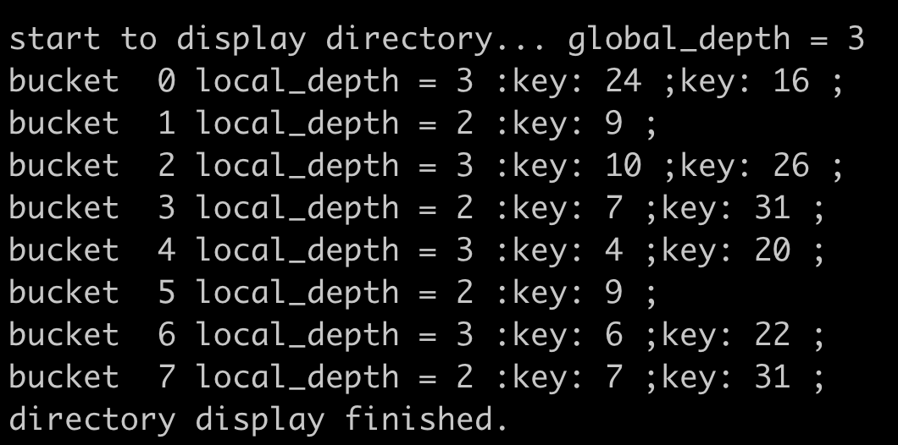

# hash
linear hash &amp;&amp; extendible hash

## linear hash

a very simple implementation of [Linear Hashing Tutorial](https://www.youtube.com/embed/h37Jhr21ByQ)

## extendible hash
a very simple implementation of [Extendible Hashing Tutorial](https://youtu.be/TtkN2xRAgv4)

